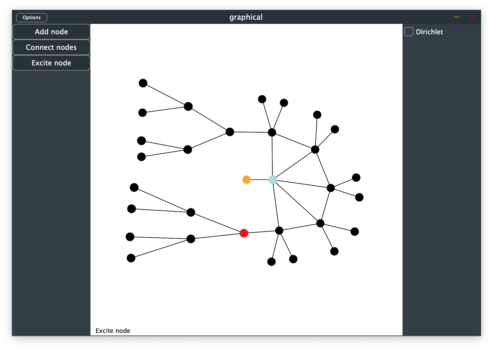

# Graph Physical Models: C++/JUCE implementation

This folder contains a real-time interactive C++/JUCE implementation of *graph
physical models*.

To compile this software you must first install [JUCE](https://shop.juce.com/get-juce)
and open *graphcal.jucer* using the *Projucer* app included with JUCE. You can
then generate a XCode (for macOS) or Visual Studio (for Windows) project which
you then build.

The project is set up as a VST plug-in but is so far only used in stand-alone
mode (though it should be able to run in common VST hosts).

## Quick start

To quickly get some just do:

* Open the application. You will see two nodes in the canvas. One of them is
  orange.
* Press the *Exicte node* tool button at the right side of the window.
* Click on one of the nodes. You should hear a bell-like sound.

## Manual

The window is divided into three sections. From left to right:

* *Tools menu* contains tools for building and manipulating models.
* *Canvas* is where you view, play and build your models.
* *Info menu* contains details and settings about the currently selected
  node(s) or tool.

### Tools menu

In the tools menu you can access the following tools:

* *Add node* add new nodes to the graph.
  * Click on the canvas to add a new node at the mouse position.
* *Connect nodes* add connections between nodes.
  * Click on a node and then on another node to connect them.
  * Hold `shift` to connect nodes continuously.
* *Add string* add a line of connected nodes
  * Click somewhere on the canvas to begin drawing a string, click again to
    finish the string.
* *Excite nodes*
  * Click on a node to excite it to produce sound.

### Canvas

The canvas is where you view play and build models. Each circle represents a
node and each line a connection.

* At the bottom right corner a text label will tell you the currently selected
  mode or tool.
* Press `esc` to exit the current mode or action. 
* Selected nodes are highlighted blue.
  * Remove selected node with backspace
* Nodes with boundary conditions are highlighted orange.

### Info menu

The info menu is currently mostly unpopulated.

* Selecting a node will show its settings in the info menu.
  * The *Dirichlet* option is used to add a Dirichlet boundary condition to the
    selected node.
