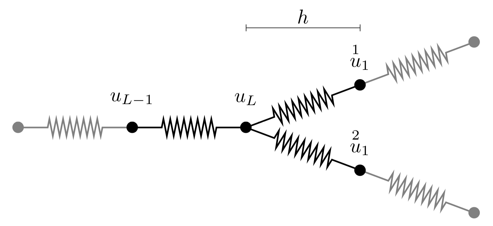

# Graph Physical Models

This repository contains code related to the currently unreleased paper
*Abstract Physical Modeling for Sound Synthesis: Graph Physical Models* which
introduces a new way of producing sounds using the principles of finite
difference schemes.

Two implementations are included in the *juce* and *matlab* folders, each
containing their on readme files.

* *juce* contains a real-time interactive C++ implementation created using the
  JUCE application framework.
* *matlab* contains a (highly inefficient) reference implementation in matlab.

# Usage

The code provided here is provided for personal and educational use only. If you use this code in relation to published research, pleae cite:

*P. J. Christensen and S. Serafin, “Graph Based Physical Models for Sound Synthesis,” in Proceedings of the 16th Sound and Music Computing Conference, Malaga, Spain, 2019, pp. 234–240.*
